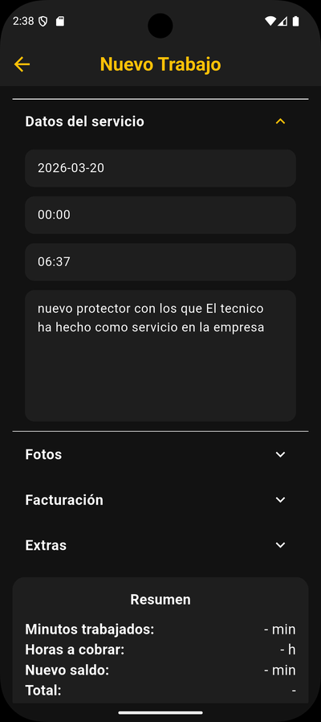
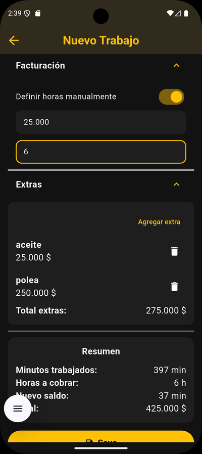
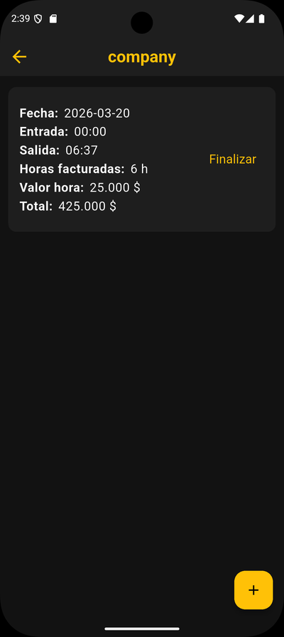

# Mecca – App de facturación para trabajadores independientes

Aplicación móvil para gestionar servicios, costos y generar reportes profesionales en PDF. Pensada para freelancers y trabajadores independientes que necesitan llevar control claro por cliente, sin depender de conexión ni backend.

## 🚀 Demo

## 🧩 Problema

El registro manual de servicios, materiales y horas genera errores, pérdida de tiempo y dificultad para entregar reportes consistentes a los clientes.

## ✅ Solución

Mecca centraliza el flujo de trabajo en una app móvil: crear clientes, registrar trabajos, adjuntar evidencia fotográfica, calcular totales y generar reportes PDF listos para enviar.

## ⚙️ Funcionalidades

- Registro de actividades, materiales y horas trabajadas
- Gestión de clientes y edición de registros
- Estados de trabajo (borrador / finalizado) para controlar el cierre
- Cálculo de valores por hora, extras y totales
- Generación de reportes en PDF listos para compartir
- Registro fotográfico asociado a cada trabajo

## 💾 Almacenamiento Local

- Persistencia 100% local con SQLite (sin backend)
- Base de datos `mecca.db` en el dispositivo
- Integridad de datos con claves foráneas activadas

## 🧠 Tecnologías

- Flutter
- SQLite (`sqflite`, `path_provider`)
- PDF (`pdf`, `flutter_pdfview`)
- Multimedia (`image_picker`, `flutter_image_compress`)
- Compartir (`share_plus`)
- Formato y fechas (`intl`)

## 👨‍💻 Rol

Desarrollo completo (frontend, lógica y persistencia local).

## 📊 Estado

Uso personal.

## 🖼️ Capturas

<table>
  <tr>
    <td></td>
    <td></td>
  </tr>
  <tr>
    <td></td>
    <td></td>
  </tr>
  <tr>
    <td></td>
    <td></td>
  </tr>
  <tr>
    <td></td>
    <td></td>
  </tr>
</table>
