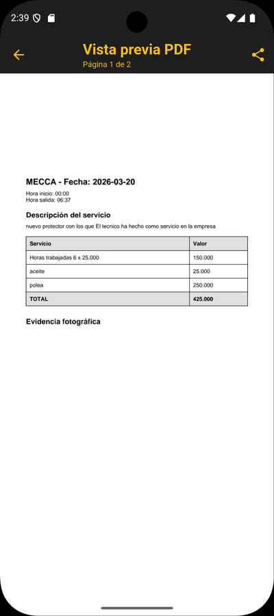

# mecca

App Flutter para gestionar empresas, trabajos y fotos asociadas con almacenamiento **local** en SQLite.

**Resumen rápido**
1. La app no requiere backend: todos los datos se guardan en el dispositivo.
2. Usa `sqflite` y `path_provider` para persistencia local.
3. La base de datos se crea automáticamente al primer uso.

**Almacenamiento local (SQLite)**
- Motor: SQLite vía `sqflite`.
- Ubicación: directorio de documentos de la app, archivo `mecca.db`.
- Alcance: **local al dispositivo** (no hay sincronización remota).
- Integridad: `PRAGMA foreign_keys = ON` habilitado.

**Esquema actual**
- `companies`
  - `id` INTEGER PK AUTOINCREMENT
  - `name` TEXT NOT NULL
  - `email` TEXT
  - `minutes_balance` INTEGER NOT NULL
- `jobs`
  - `id` INTEGER PK AUTOINCREMENT
  - `company_id` INTEGER NOT NULL (FK → `companies.id` ON DELETE CASCADE)
  - `date`, `start_time`, `end_time` TEXT NOT NULL
  - `service` TEXT NOT NULL
  - `minutes_worked`, `hours_charged`, `value_per_hour` INTEGER NOT NULL
  - `extras_json` TEXT NOT NULL
  - `extra_value`, `total_day` INTEGER NOT NULL
  - `status` TEXT NOT NULL
- `jobs_photos`
  - `id` INTEGER PK AUTOINCREMENT
  - `job_id` INTEGER NOT NULL (FK → `jobs.id` ON DELETE CASCADE)
  - `path` TEXT NOT NULL
  - `created_at` TEXT NOT NULL

**Flujo de datos (local)**
- Empresas: CRUD en `companies` desde `CompanyRepository`.
- Trabajos: se crean como `draft`, se editan localmente y se finalizan con una transacción que:
  - cambia el `status` a `finalized`
  - actualiza el saldo de minutos de la empresa
- Fotos de trabajo: se guardan en `jobs_photos` con la ruta del archivo en el dispositivo.

**Ejecución**
1. `flutter pub get`
2. `flutter run`

**Ubicación del código clave**
- Base de datos: `lib/core/database/app_database.dart`
- Repositorios:
  - `lib/features/companies/data/company_repository.dart`
  - `lib/features/jobs/data/job_repository.dart`
  - `lib/features/jobs/data/job_photos_repository.dart`

**Pantallas (tamaño controlado en la documentación)**
<table>
  <tr>
    <td></td>
    <td></td>
  </tr>
  <tr>
    <td></td>
    <td></td>
  </tr>
  <tr>
    <td></td>
    <td></td>
  </tr>
  <tr>
    <td></td>
    <td></td>
  </tr>
  <tr>
    <td></td>
    <td></td>
  </tr>
</table>
